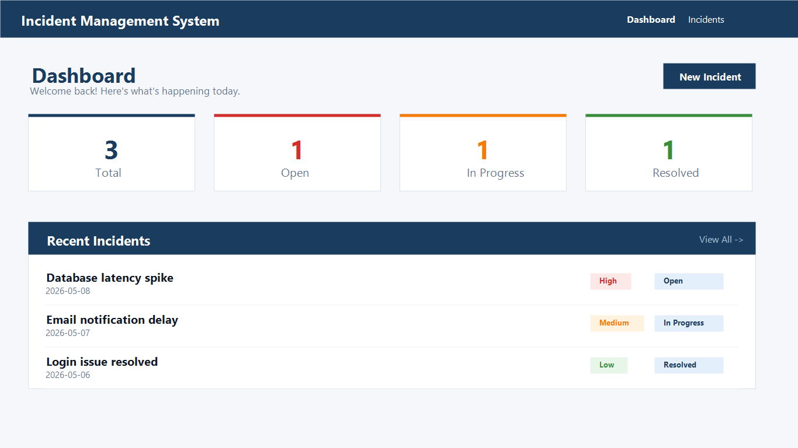
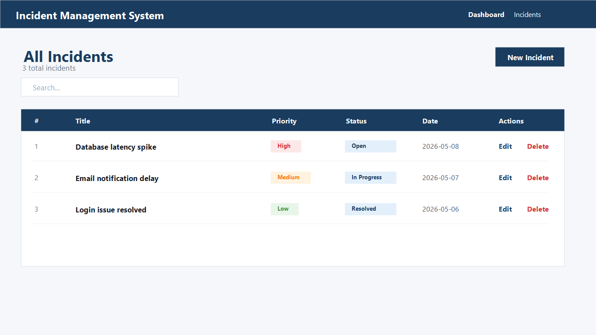
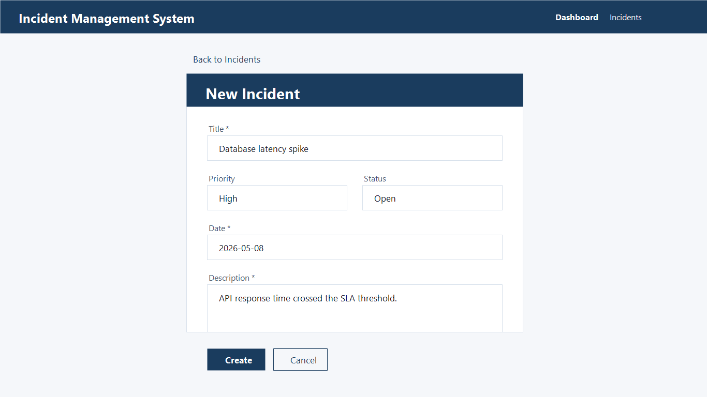

# Incident Management System

A full-stack incident tracking application built with React, Spring Boot, and MySQL. It lets support or operations teams create incidents, track their priority and status, search records, and manage the incident lifecycle through a clean dashboard.

## Highlights

- Dashboard with total, open, in-progress, and resolved incident counts
- Incident CRUD workflow with validation
- Searchable incident table with priority and status indicators
- REST API built with Spring Boot and Spring Data JPA
- MySQL persistence using Hibernate
- Separate frontend and backend folders for easy local development

## Tech Stack

| Layer | Tools |
| --- | --- |
| Frontend | React, React Router, Material UI, Axios |
| Backend | Java 17, Spring Boot, Spring Web, Spring Data JPA |
| Database | MySQL |
| Build tools | npm, Maven |

## Project Structure

```text
.
|-- incident-managing-system/   # React frontend
`-- incidentmanagement/         # Spring Boot backend
```

## Output Screenshots

### Dashboard



### Incident List



### Create Incident



## Getting Started

### Prerequisites

- Java 17
- Maven
- Node.js and npm
- MySQL running locally

### Database

Create a MySQL database named `incidentdb`, or let the backend create it automatically from the configured JDBC URL.

The default local database settings are in `incidentmanagement/src/main/resources/application.properties`:

```properties
spring.datasource.url=jdbc:mysql://localhost:3306/incidentdb?createDatabaseIfNotExist=true
spring.datasource.username=${DB_USERNAME:root}
spring.datasource.password=${DB_PASSWORD:}
```

Set `DB_USERNAME` and `DB_PASSWORD` for your local MySQL setup before running the backend.

### Backend

```bash
cd incidentmanagement
mvn spring-boot:run
```

The API runs at `http://localhost:8080`.

Main endpoints:

- `GET /api/incidents`
- `GET /api/incidents/{id}`
- `POST /api/incidents`
- `PUT /api/incidents/{id}`
- `DELETE /api/incidents/{id}`

### Frontend

```bash
cd incident-managing-system
npm install
npm start
```

The React app runs at `http://localhost:3000` and calls the backend at `http://localhost:8080/api`.

## Recruiter Notes

This project demonstrates full-stack CRUD development, REST API integration, database persistence, layered backend architecture, and a React dashboard UI. The code is organized so the frontend and backend can be reviewed independently.

## Author

Siva Ragul
